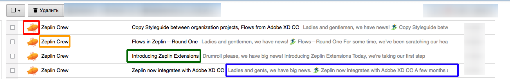

[](https://app.netlify.com/sites/pensive-meitner-4440df/deploys)
# Тестовое задание

Дан файл [data.json](data.json), в нём содержится информация о письмах.
Взяв всю необходимую информацию из файла, необходимо сверстать список писем с возможностью их удаления (в том числе множественного), добавить список в Storybook и задеплоить Storybook в Интернет. В случае пустого списка необходимо отображать заглушку. В качестве макета можно использовать [веб-версию Почты](https://e.mail.ru).

## Технологический стек

+ [React](https://reactjs.org/)
+ [Storybook](https://storybook.js.org/)

## Плюсом будет

+ [Typescript](https://www.typescriptlang.org/)
+ Документация
+ Покрытие тестами
+ CI / CD

## Стуктура письма в [data.json](data.json)



`id` - уникальный идентификатор письма

`avatar` - ссылка на аватар отправителя 

`sender` - имя отправителя 

`theme` - тема (заголовок) письма 

`snippet` - фрагмент тела письма, отображаемый в списке писем 

#Установка, запуск и тд.

## Ссылка на проект

[storybook](https://pensive-meitner-4440df.netlify.app/?path=/story/letter-box--letter-box)

## Установка и запуск

Установка зависимостей

```
npm install
```

Сборка

```
npm run build
```

Запуск dev сервера

```
npm start
```

Запуск eslint

```
npm run linter
```

Запуск тестов

```
npm run test
```

Запуск Storybook

```
npm run storybook
```


Сборка Storybook

```
npm run build-storybook
```